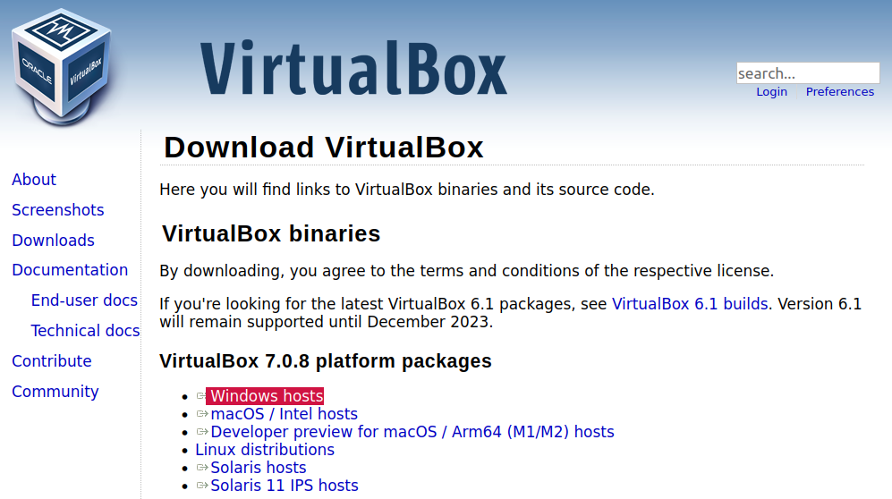

# 準備開發環境 (Getting ready!)

[開發環境] 指的是撰寫各種程式時，需要先做好的設定以及軟體。以 Loki NLU 平台而言，我們通常會需要：

1. IDE (我強烈推薦 [Wing Pro](https://wingware.com/) ，以下的說明也將以 Wing Pro 擷圖示範說明。學校教育用途可申請 [Classroom Use](https://wingware.com/store/free) 的免費授權)
2. 終端機 (在 Mac/Linux 下，終端機又稱為 Terminal。在 Windows 下，則通常被稱做 [命令提示字元]。兩者開啟起來，都是一個黑黑 (或白白) 的視窗，用來輸入指令用的。

就這兩個東西，但因為 Windows 有各種不同的版本，而 Mac 又有兩種不同的 CPU 架構，在接下來的章節裡，我將提供各種不同的方案，請讀者依自己的電腦設備條件選擇其中一種

 - 我只知道是 Windows 的電腦，其它什麼都不知道 [傳送門](https://github.com/Droidtown/Loki_NLU_The_Handbook/blob/main/Chapter_01_Get_ready.md#%E5%8F%AA%E7%9F%A5%E9%81%93%E6%98%AF-windows-%E7%9A%84%E9%9B%BB%E8%85%A6%E5%85%B6%E5%AE%83%E4%BB%80%E9%BA%BC%E9%83%BD%E4%B8%8D%E7%9F%A5%E9%81%93)
 - 我的 VirtualBox 無法匯入 **NLP\_TrainingLab** 或無法運作 **NLP\_TrainingLab**
 - 我用 Windows 的電腦，而且已有安裝 Anaconda 或其它 Python 版本
 - 我用 Mac 電腦，CPU 是 i 系列的 (Intel Core i5 或 i7)
 - 我用 Mac 電腦，CPU 是 M 系列的
 - 我用 Linux 電腦 (That would be easy.)

### 只知道是 Windows 的電腦，其它什麼都不知道…
因為 Windows 的版本眾多，為了避免不同的 Winodws 各自的設定不同而雞同鴨講，所以我們準備了一個 VirtualBox 的虛擬機器，將設定全部做好了！

你可以簡單地把 VirtualBox 理解成「一部虛擬的電腦主機」，我們要在這部虛擬的電腦主機裡安裝一個虛擬的作業系統，叫做 NLP_TrainingLab。

 VirtualBox 虛擬機器是免費的，而 NLP_TrainingLab 虛擬系統也是免費的！

接下來有兩大部份，分別有三個步驟：
先下載與安裝 VirtualBox 虛擬主機

**1.1** 下載 VirtualBox：
先到這裡下載 VirtualBox：[https://www.virtualbox.org/wiki/Downloads](https://www.virtualbox.org/wiki/Downloads) 

**1.2** 安裝 VirtualBox：
Windows 環境下的安裝，就依序完成 [下一步] 的指示即可。

**1.3** 啟動 VirtualBox 然後會看到類似以下的畫面：

#### 完成 VirtualBox 下載和安裝以後，接下來只要：

**2.1** 下載虛擬系統
點擊：下載連結
檔案有點大，約 3.5GB，請耐心稍待…

**2.2** 匯入虛擬系統
	i. 啟動 VirtualBox
		
	ii. 點擊左上方的 [工具] 接著點擊 [匯入]
		

**2.3** 啟動虛擬系統
    啟動 VirtualBox
		
    選擇虛擬系統 NLP_TrainingLab，再點擊 [啟動] 讓它開機，待出現以下畫面就完成開機囉
		

