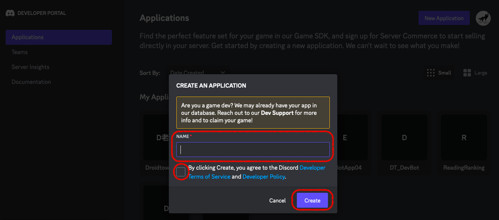
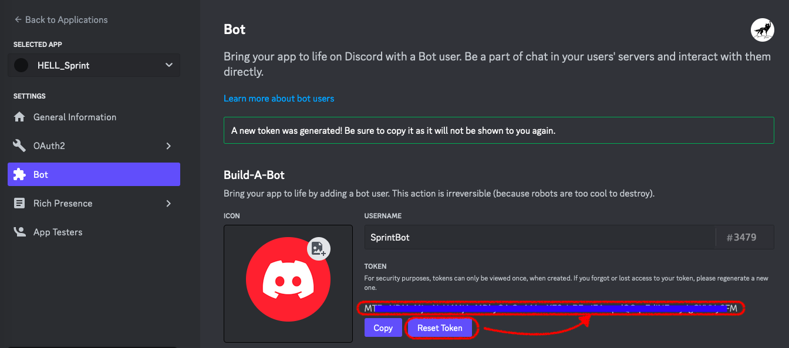
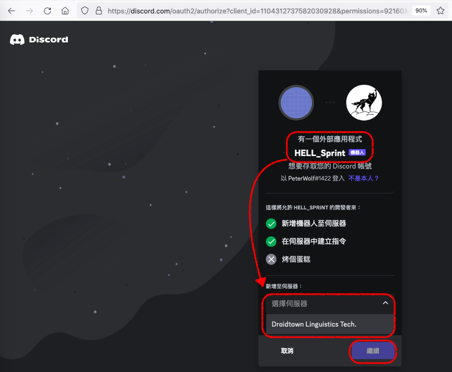

# 設定 Discord 聊天機器人 (Setting up a Discord chatbot)

Discord 是一款免費的通訊應用程式，讓你可以與朋友、遊戲社群以及開發者透過語音、視訊或文字聊天之餘，它還可以很方便地自訂一個聊天機器人。

本章內容將帶領你在 Discord 開發者網站裡註冊一個機器人，並賦予它最基本的「文字聊天」的能力。但我們豈會滿足於「基本」的聊天能力呢？因此，在下一章將會帶領你把 Discord 串接上 Loki 自然語言理解系統，讓你的聊天機器人更能掌握語言的細微精妙之處。

#### [提醒] 在開始以前，請先確定已經跟著 [Chapter01](https://github.com/Droidtown/Loki_NLU_The_Handbook/blob/main/Chapter_01_Get_ready.md) 的內容設定好你的開發環境了！


> ### 設定 Disocord 聊天機器人包含三個步驟  
> 1. 創建新的機器人
> 2. 將第一步裡的機器人，透過 URL 加到 Discord 伺服器裡
> 3. 在本機 (就是你的電腦) 上執行 myBot.py 的機器人程式
> 4. 發生錯誤訊息怎麼辦？

----
## 1. 創建新的機器人
首先到 [Discord Developers 網站](https://discord.com/developers/)，登入你的 Discord 帳號以後，點名右上角的 [New Application]…  
  

輸入這個機器人的應用場景 (這個名稱之後是可以更改的，所以不用擔心)。接著按下 [Create]  
  

接著會進入你剛剛新建這個 Application 的設定頁面。請選擇左邊的 [Bot]，然後為你的聊天機器人取個名字 (最好取個看得出來它是個 Bot 的名字)。如果這裡沒有取名字的話，它預設會代入你的 Application 名稱。  
  
  
再來點擊 [Reset Token] 取得聊天機器人的 token，這一串符號稍後會用到，它只會「出現這一次」，下次再出現時，內容就更新了。所以請先把它儲存在自己的電腦裡。  
  
  
最後，在畫面左邊切換到 [OAuth2] 的頁面，賦予這個聊天機器人 "Bot" 的權限，再把頁面往下滑，允許它做四種任務，並把最下面的 URL 複製起來，貼到瀏覽器裡：  
  
  
  
  
## 2. 透過 URL ，把剛才創建的機器人加到 Discord 伺服器裡 
如果這個機器人要加入自己的 Discord 空間裡，就將 URL 貼到自己的瀏覽器；如果這個機器人要加入 Droidtown 的空間裡，就將 URL 傳給管理者。

你 OR 管理者就會看到像這樣的畫面。選擇你要加入的 Discord 空間裡，並按下 [繼續]  進入 [授權成功] 的畫面。這時候就可以關掉瀏覽器了。
  
  
  
  
## 3. 在本機 (就是你的電腦) 上執行 myBot.py 的機器人程式
首先 [下載這支範例程式](https://raw.githubusercontent.com/Droidtown/LokiHub/main/Discord_bot_Template/Discord_bot_ProjName.py)。接著使用在 Chapter01 安裝的 Wing Pro 打開這個檔案。

然後在約第 90 行以後，找到這一段，把它調整成以下的模樣…  
    
第 93~94 行，在行首加上 # 號。然後再新增兩行：  
```python
    accountDICT = {}
    accountDICT["discord_token"] = "blah...blah...blah..."
```
記得將 `blah...blah...blah...` 換成你自己的 Discord token！

至此，你的 Discord Chatbot 就完成了！
在 Wing Pro 裡，點擊最上面的綠色三角形，來執行這支聊天機器人程式…  
    
  
如果你在 Wing Pro 的右下畫面裡的 [Debug I/O] 分頁裡，可以看到最後一句寫著 "Logged on as .... with id ...." 的字樣，那麼你的聊天機器人就上線囉。  
    

接著你就可以到 Discord 裡，用 @ 符號來呼叫你的 Chatbot，並傳給它 "ping"，它就會回覆你 "pong" 囉！  
    
  
如果你啟動 Chatbot 的時候，遇到這種錯誤：  
    

別緊張，那表示你的 token 因為某些緣故失效了 (通常是你不小心貼到網路上去，或是上傳到 github.com …等等原因)。這時候只要回到  [Discord Developers 網站](https://discord.com/developers/)，在左邊找到 [Bot] 的分頁，然後點擊 [Reset Token] 的按鈕，把新的 token 存在自己電腦裡。然後再更新到上面說的…
```python
    accountDICT["discord_token"] = "blah...blah...blah..."
```
這裡就行了。

目前為止，這個 Chatbot 的能力只有「收到 ping，回覆 pong；收到 ping ping，回覆 pong pong」這樣而已。

我們在下一章裡將會介紹 Loki 的 Chatbot 模式，來說明如何擴充你的聊天機器人的語言能力。

## 4. 發生錯誤訊息怎麼辦？
- SSL 問題
新的 Mac (M1/M2...等 ARM 架構 CPU 的蘋果電腦) 可能會遇到某種 SSL 的錯誤，訊息裡包含這種內容：

```bash
SSL: CERTIFICATE_VERIFY_FAILED...
```
那只要下載這個檔案 ([連結](./src/install_certifi.py)) 接著執行它，然後再啟動一次 Discord 就行了。

- ModuleNotFoundError: No module named 'discord'
如果你的電腦裡不曾安裝過 discord 的模組。在 Mac 裡，請打開終端機 (或叫 Terminal)，而在 Windows 電腦裡，請打開命令提示字元 (或搜尋 `cmd`)，然後輸入以下指令來安裝 discord 模組：

```python3 -m pip install discord.py```
然後再啟動一次 Discord 就行了。

- ModuleNotFoundError: No module named 'requests'
如果你的電腦裡不曾安裝過 requests 的模組。在 Mac 裡，請打開終端機 (或叫 Terminal)，而在 Windows 電腦裡，請打開命令提示字元 (或搜尋 `cmd`)，然後輸入以下指令來安裝 discord 模組：
`python3 -m pip install requests`
然後再啟動一次 Discord 就行了。
