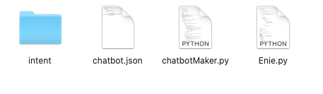
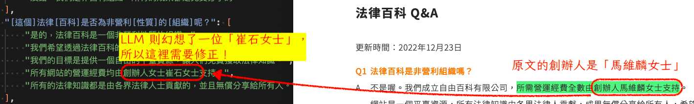
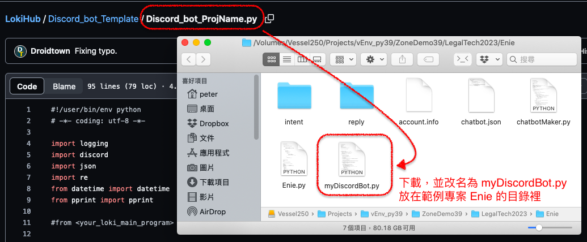

# Loki Chatbot 模式 (Loki Chatbot Mode)

Loki 是一個通用的 NLU (Natural Language Understanding) 平台。它的運作原理是透過句型比對，來找到和訓練資料一致的句型，並依設定的程式邏輯回覆。

Loki  的 Chatbot Mode 則是串接了 NLG LLM 的生成能力，一方面可以讓開發者降低準備訓練資料的負擔，另一方面也簡化了開發者要思考怎麼讓聊天機器人回覆的工作 -- 只要利用現有的 FAQ 文件就可以了。

本章內容將帶領你設定一個 Loki Chatbot Mode 的專案，並在最後和前一章的 Discord 做串接，讓你可以在本篇結束時，就能做出一個可以互動的 Chatbot 了。

#### [提醒] 在開始以前，請先確定已經跟著 [Chapter02](https://github.com/Droidtown/Loki_NLU_The_Handbook/blob/main/Chapter_02_Discord_Chatbot.md) 的內容設定好你的 Discord，讓它已經可以收到 ping ping 回覆 pong pong 了！


> ### 設定 Loki Chatbot 包含三個步驟  
> 1. 創建新的 Loki 專案
> 2. 設定 LLM 的 API，並啟用 Chatbot 模式
> 3. 找到 FAQ 裡的一個問題，為這個問題創建一個意圖 (intent)
> 4. 新建一個例句 (utterance)，並透過 LLM 擴展這個例句
> 5. 把例句裡的關鍵詞保留，將其它詞彙勾選予以變化的空間
> 6. 給 LLM 設定 FAQ 的參考文獻
> 7. 下載範例程式，並執行 ChatbotMaker.py
> 8. 編輯與複核 LLM 產生的回覆
> 9. 和 Discord 做串接

----
## 1. 創建新的 Loki 專案
首先到 [Droidtown API 網站 https://api.droidtown.co](https://api.droidtown.co)，在右上角登入你的帳號以後  
  

點擊畫面中的 [Loki] > [開始使用 Loki]  
  

在新的分頁裡，輸入一個新專案名稱 (這裡以 Enie 為例)，然後點擊 [建立專案] > [Enie] 進入 Enie 專案裡  
  

## 2. 設定 LLM 的 API，並啟用 Chatbot 模式
先取得你要使用的 LLM 的 API Key。

以 OpenAI 為例，登入 [OpenAI 的網站](https://platform.openai.com/)，點擊右上角的帳號圖示，找到 [View API Keys]  
  
  
接著在 [API Keys] 的分頁裡，點擊 [Create new secret key] 來取得你的 OpenAI Key.  
  
回到 Loki 的頁面，點擊 [設定生成模型] 選擇 ChatGPT (因為這裡以 ChatGPT 做示範說明。如果你用其它的 LLM 服務，請依你的設定做選擇) ，並將上一步取得的 OpenAI Key 填入對應的欄位。  
  
  
  別忘了把 [Chatbot 模式] 打開：  
    

最後，點擊 [建立基本意圖]，  
    
  
## 3. 找到 FAQ 裡的一個問題，為這個問題創建一個意圖 (intent)
## 4. 新建一個例句 (utterance)，並透過 LLM 擴展這個例句
步驟 3 和 4 是連續動作。

我們假設將 [意圖名稱] 命名為 `Question01`，接著按下 [建立意圖]，然後把你要做的 FAQ 文件裡的一個問題貼入，再按下 [單句分析]，之後再點擊 [生成同義句] 讓 LLM 產生把這個句子換句話說…
    

> [註] 我以 [法律百科的 Q&A](https://www.legis-pedia.com/faq) 裡的第一題為例。所以上圖的的語句是從[法律百科的 Q&A ]頁面來的。
      
  
LLM 會試圖產生幾個和我們指定的語句意思接近的句子。  
      

但因為 LLM 不是真的懂語言裡的語意，所以有些句子的意思不太通順，或是和原來指定的語句意義不太一致。此時請略過它們不要勾選。完成勾選以後，點擊右下角的 [增加勾選的同義句]  
      
  
## 5. 把例句裡的關鍵詞保留，將其它詞彙勾選予以變化的空間
這個題目的關鍵就是「法律百科」和「非營利」，其它的詞彙都可能會變化。例如「5. 法律百科是否為一個非營利性的`組織`？」就有可能講成「法律百科是否為一個非營利性的`單位`？」因為「單位」和「組織」被替換的話，句子的意思不太會變化。因此我們把它勾起來，表示這個詞可被替換。其它不勾選的詞彙，表示這個詞「不可以被替換成別的詞！」
  

接著可以把每個句子都再按幾次 [生成同義句]，讓這個 Loki 模型學會更多的句子。一般的情況下，多多益善！如果 LLM 開始生成一些太長的句子 (LLM 是生成模型，它的專長就是短話長說地長出很～長～的句子)，你可以視情況將其做一些修改。比如把開頭的「請問」刪掉，畢竟很多人不會對機器人很禮貌，你教機器人的句子都是禮貌的「請問」開頭，將來它遇到不禮貌的人時，就會聽不懂了。
  
## 6. 給 LLM 設定 FAQ 的參考文獻
前面我們教會了 Loki 怎麼「聽懂」別人說什麼，接著我們要教它如何「查資料以便回答對方的問題」。

畫面往下滑到底到第 7 小節設定，點擊 [Assistant 內容管理] > [新增內容]：  
  
  
我們取回剛才參考的「法律百科 Q&A」的內容，填入 [Assistant 內容管理] 裡。第一欄「內容標題] 是人讀的，只要你看得懂就行。我這裡直接放 Q 的內容。接著點擊 [增加欄位] 後，我增加了一欄為 Q (這個代號稍後會用到)，並把「法律百科 Q&A」裡的 Q 放到它的對應 Value 裡。接著再新增一欄為 A (這個代號稍後會用到)，並把「法律科百 Q&A」裡的 A 也放到它的對應 Value 欄位裡。接著點擊 [儲存內容]！
  
  
接下來，我們要設定 Prompt 的指示文字。

因為我們做的是繁體中文的 FAQ Chatbot，所以指示 System「你是一個繁體中文 FAQ 助理」，以便讓它回答時以繁體中文為優先考量。接著，在 Assistant 欄裡告訴它，如果有人問你問題，你可以去參考 {{Q}} 和 {{A}} 的內容。這裡的 Q 和 A 用兩層大括號包起來，表示它就是上一步裡設定的 Q 和 A 的內容。

最後，再告訴它「請依前文，擬定 5 個回覆「{{UTTERANCE}}」的答案。這裡的 UTTERANCE 指的就是上面 [步驟 3] 和 [步驟 4] 裡的句子。  
  
  
這一段的設定，就是告訴 Loki：「轉告 LLM ，如果有人用上面的句子的結構來問你，你就用剛才給你的參考答案來產生回覆的文字。」  
  
  
設定完後，畫面稍微上滑一點，點擊 [部署模型]，讓模型部署到伺服器裡。

## 7. 下載範例程式，並執行 ChatbotMaker.py
模型部署完成以後，點擊左上方的「小房子」圖示，回到最上層：  
  
  
找到專案的名稱，右邊有個 [下載範本] 的下拉式選擇，請選擇 [Python] 的版本下載：  
  
  
下載後是一個 .zip 檔，把它解壓縮到同名的資料夾裡：  
  
  
它的內容長這樣：  
  
  
我們先準備一個叫 account.info 的檔案，和它們排在一起。account.info 的檔案內容像這樣：

```txt
{
    "username": "你用來登入 https://api.droidtown.co 的那個 email",
    "loki_key" : "依下一張圖取得 loki_key 並貼到這裡來"
}
```  

步驟如下：  
  

接下來，打開 ChatbotMaker.py 這支程式，並執行它：  
  
  
## 8. 編輯與複核 LLM 產生的回覆
由於 LLM 基本上是一個 NLG 生成模型，它的專長是「生成」而不是「理解」，所以有時候它會抓錯重點，產生出不適合的答案。

還好，所有的答案都存在 reply 目錄裡了，我們來看看它的回覆是否合適。並做適當的編修：  

打開 `reply` 目錄裡的 `reply_Question01.json` 檔後，發現有一個答案不適當…  
  

將生成錯誤的答案刪除或是修正以後。這個步驟就完成了！

## 9. 和 Discord 做串接
首先把我們這個示範專案的主程式 Enie.py 和雲端的伺服器串起來。打開 Enie.py ，在大約 55 行左右，找到一段程式碼如下：

```python
LOKI_URL = "https://api.droidtown.co/Loki/BulkAPI/"
USERNAME = ""
LOKI_KEY = ""
```

把它改成：(你可以複製下面這一段，然後把上面那一段蓋掉)

```python
import json
with open("account.info", encoding="utf-8") as f:
    accountDICT = json.load(f)
LOKI_URL = "https://api.droidtown.co/Loki/BulkAPI/"
USERNAME = accountDICT["username"]
LOKI_KEY = accountDICT["loki_key"]
```

最後的結果應該要像這樣：
  

接著把 Chapter02 裡的 DiscordBot.py 檔抓過來用。如果已經刪了，可以重新從 LokiHub 裡抓 template 回來改。以下我示範從 template 裡抓回來改的作法：  
  
  
下載 template 檔，放在 Enie.py 旁邊，並且檔案改名為 myDiscordBot.py 以後，打開這個檔案，把大概在第 11 行前後的：

```python
#from <your_loki_main_program> import runLoki
```

改成如下：

```python
from Enie import runLoki
```

也就是先把 # 字號刪除，並把 `<your_loki_main_program>` 改為 Enie。因為我們目前的示範專案叫 Enie。這裡要視你的專案名稱做符合你的情況的調整。

接著讓 Loki 接手 Discord 的語意理解功能。找到有一行寫著：  

```python
                #從這裡開始接上 NLU 模型
```
的地方，在其下面加一行：  

```python
                replySTR = resultDICT["response"]
```
記得讓它和上一行對齊，像這樣：
  

接著打開 `account.info` 檔案，加上一段 `discord_token`，如下：

```txt
{
    "username": "你用來登入 https://api.droidtown.co 的那個 email",
    "loki_key" : "<你的 loki project 的金鑰>",
    "discord_token":"<填入你的 Discord Bot 的 Token>"
    
}
```  

最後，再確認一下 `myDiscordBot.py` 的最後幾行長這個樣子…  
  

就可以啟動你的 Discord Chatbot 了。  
  

我們試試看它已經學會的句子：`法律百科是否屬於非營利性質的組織？`  
  

由於 Loki 是依照「句型結構」來判斷相似性的，再加上我們之前把「組織」勾選起來，讓這個結構位置可以換成其它名詞。如下：  
  
  
因此，此時 Loki 也可以處理它沒看過的句子，比如說把：`法律百科是否屬於非營利性質的組織？`  裡的「組織」改成「單位」，像這樣 `法律百科是否屬於非營利性質的單位？`    
  
  
它也是能理解的哦！

從 Chapter01 到 Chapter03 的現在，只要你把 Q&A 裡的每一個問題，都創建一個意圖 (intent)，再透過 LLM 增加每個意圖裡的語句 (utterance)，並且勾選可以變化的單位，並且給予這個模型參考的文獻，就能做出一個完整的 Q&A Chatbot 囉！